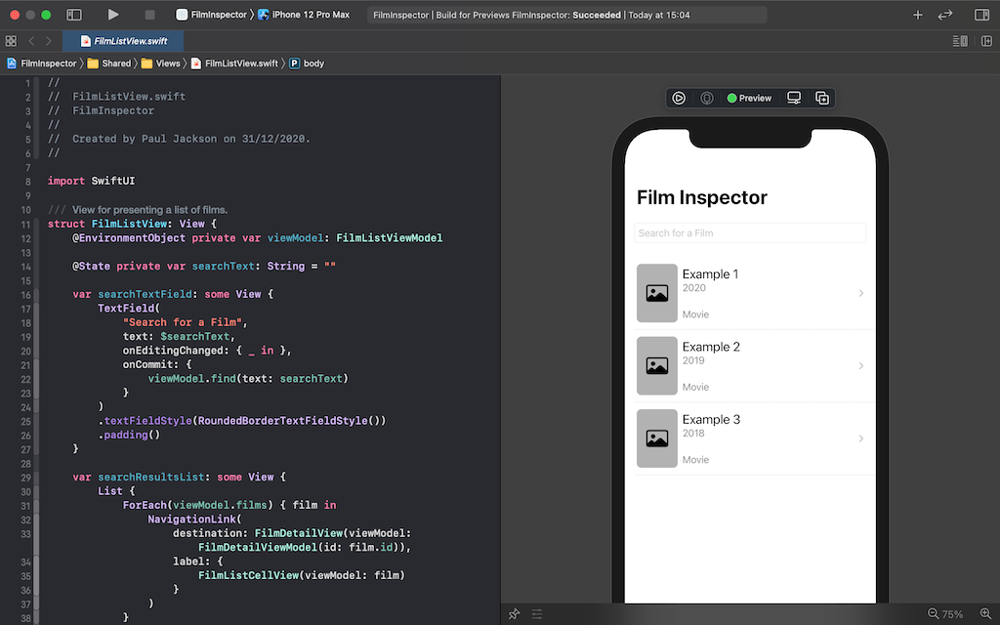
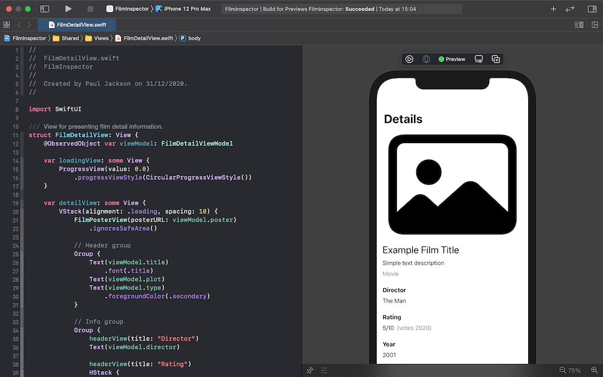

# Film Inspector

    
    
    
    

This is an iOS app that enables you to search for and inspect film information. This is primarily a Swift, SwiftUI and Combine app build for mobile, by exploring the MV-VM pattern. The data source is the excellent and open source [Open Movies Database](https://www.omdbapi.com). 

## Inspiration
I was inspired to build this app after I bought an online course at the start of winter 2020 on MV-VM with SwiftUI; at the time I'd been deep diving learning how to use SwiftUI in various forms, and I'd used MV-VM in the past to great effect when working with Windows Presentation Foundation a long time ago. However, I had tried in an earlier experiment a year or two ago with MV-VM and SwiftUI when it was fresh out of the box, but with limited success.

The course was in a winter sale I thought I'd give it a go and see if I could work out what I'd missed and learn how to use the pattern properly with SwiftUI. Sadly, overall the course left me feeling a little underwhelmed. I realised that without question their solution was a SwiftUI solution, but it was not really in keeping with SwiftUI.

I thought I might be able to do a more idiomatic job myself and experiment with the MV-VM pattern again. This app is the result.

## Previews
With this development I had a couple of goals. One was that I wanted the SwiftUI previews to be useful, often they get abandoned early in the process and the design of the code means that previews become hard to maintain. By using the view models I think I have successfully managed to pull that off:

## MV-VM Pattern
In this case I think the use of the pattern was a success, more successful than my previous attempts anyways. However, this project is super simple and I'm still not sure how I would feel about using it in more complex scenarios. View models are certainly an attractive place to put view translation logic and example content for previews. So on that score it was a success.

## License
As this a learning project for me I would be really happy if anyone gets anything useful from the code. All the source code that is in this project is licensed under the MIT license. To be clear, this is any file that has the “.swift” file extension. Additionally, I have written all the code myself and have **not** used any code directly from the online course or project, that course was inspiration only.

Here is the MIT license:

---

Copyright (c) 2021 Paul Jackson

Permission is hereby granted, free of charge, to any person obtaining a copy of this software and associated documentation files (the "Software"), to deal in the Software without restriction, including without limitation the rights to use, copy, modify, merge, publish, distribute, sublicense, and/or sell copies of the Software, and to permit persons to whom the Software is furnished to do so, subject to the following conditions:

The above copyright notice and this permission notice shall be included in all copies or substantial portions of the Software.

THE SOFTWARE IS PROVIDED "AS IS", WITHOUT WARRANTY OF ANY KIND, EXPRESS OR IMPLIED, INCLUDING BUT NOT LIMITED TO THE WARRANTIES OF MERCHANTABILITY, FITNESS FOR A PARTICULAR PURPOSE AND NONINFRINGEMENT. IN NO EVENT SHALL THE AUTHORS OR COPYRIGHT HOLDERS BE LIABLE FOR ANY CLAIM, DAMAGES OR OTHER LIABILITY, WHETHER IN AN ACTION OF CONTRACT, TORT OR OTHERWISE, ARISING FROM, OUT OF OR IN CONNECTION WITH THE SOFTWARE OR THE USE OR OTHER DEALINGS IN THE SOFTWARE.